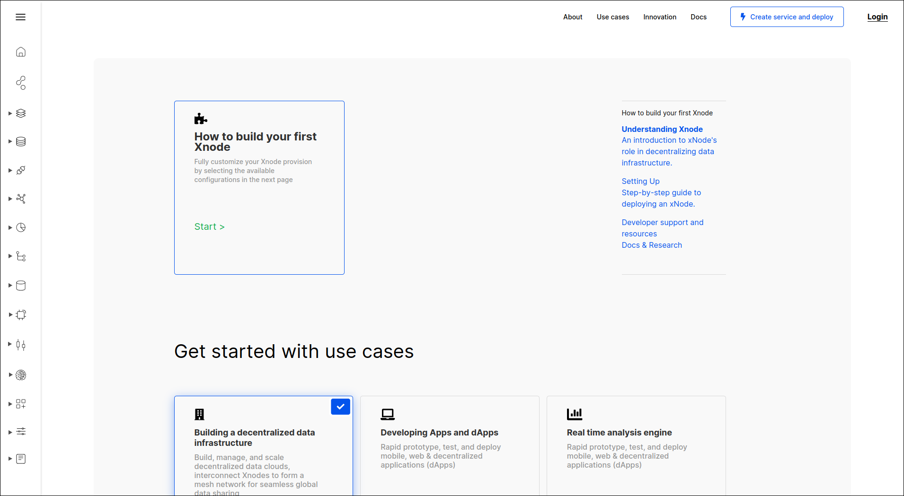
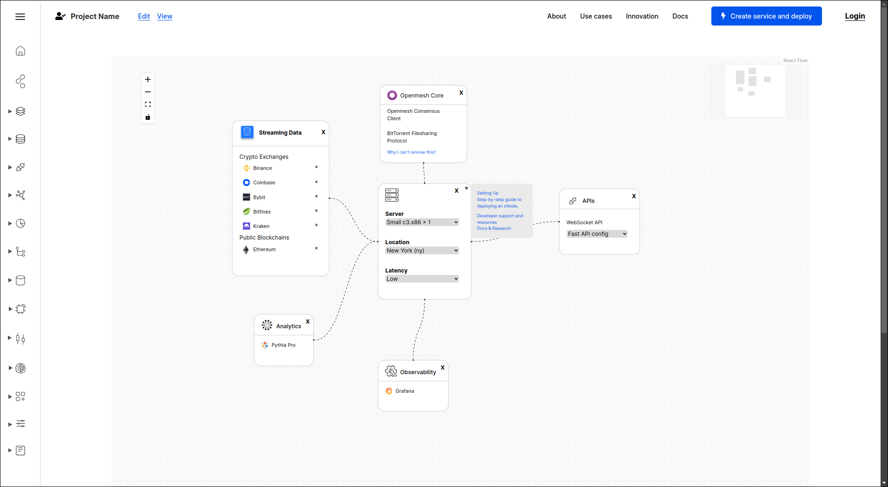

# XNode Console Frontend

A drag and drop node editor to deploy Xnodes on baremetal.

Currently can only deploy on Equinix baremetal, but more providers will be supported in the future.

See it in action at [openmesh.network/xnode](https://openmesh.network/xnode).

## Screenshots

